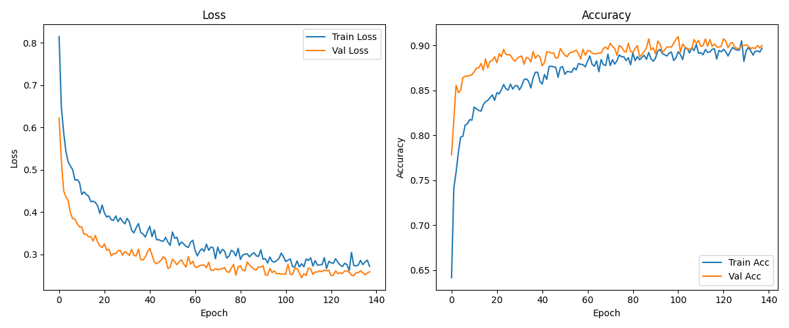

# MLP-Scheduling-Predictor_OSPROJ

This project implements a **Multi-Layer Perceptron (MLP)** neural network to predict the **optimal CPU scheduling algorithm** for a given set of processes based on their arrival and burst times.

Developed as the **final project for the Operating Systems course** at **Hamedan University of Technology (HUT)**.

---

## **Project Goal**

To automatically predict which scheduling algorithm minimizes **total waiting time** among the following:

* `FCFS` (First Come First Serve)
* `SJF` (Shortest Job First)
* `RR` (Round Robin, quantum = 4)

Implemented using **PyTorch** with **advanced training techniques** (Batch Normalization, Dropout, Early Stopping, ReduceLROnPlateau, GPU support).

---

## **Dataset**

The dataset is **synthetically generated** using `dataset_generator.py`.

* **Default size:** 1200 samples (balanced: 400 per class)
* **Each sample includes:**

  * 4 **Arrival Times** (P1–P4)
  * 4 **Burst Times** (P1–P4)
  * **Best\_Algorithm** (target label)
  * **FCFS\_WT**, **SJF\_WT**, **RR\_WT** (waiting times for all algorithms — always included in output)

### **Tie-breaking rules**

* If `FCFS` and `SJF` tie → **FCFS**
* If `FCFS` and `RR` tie → **RR**
* If `SJF` and `RR` tie → **SJF**

---

### **Generate Dataset**

Default balanced mode (1200 rows, includes WT columns by default):

```bash
python dataset_generator.py
```

Generate unbalanced dataset (example):

```bash
python dataset_generator.py --unbalanced --n_total 1500
```

Change ranges (example):

```bash
python dataset_generator.py --arr_high 100 --bt_high 30 --n_per_class 2000
```

---

## **Model Architecture**

* **Input Layer:** 8 features (4 arrivals + 4 bursts)
* **Hidden Layers:**

  * Layer 1: 256 neurons (BatchNorm + ReLU + Dropout 0.4)
  * Layer 2: 128 neurons (BatchNorm + ReLU + Dropout 0.3)
  * Layer 3: 64 neurons (BatchNorm + ReLU + Dropout 0.2)
* **Output Layer:** 3 neurons (one per scheduling algorithm)
* **Loss Function:** CrossEntropyLoss
* **Optimizer:** Adam with L2 regularization
* **Scheduler:** ReduceLROnPlateau (dynamic LR reduction)
* **Regularization:** Dropout + Weight Decay
* **Early Stopping:** Enabled (patience = 30 epochs)
* **GPU Training:** Supported (auto-detection)

---

## **Training Features**

✔ Batch Normalization

✔ Dropout

✔ Learning Rate Scheduler (ReduceLROnPlateau)

✔ Early Stopping

✔ Training visualization (Loss & Accuracy curves)

✔ Model saving (best and last checkpoints)

✔ Scaler saving (for consistent predictions)


---

## **Results (Example Run)**

Device: cpu
* **Final Test Accuracy:** 90%
* **Final Test Loss:** 0.2584

### Classification Report

```
              precision    recall  f1-score   support

        FCFS     0.9462    0.8350    0.8871       400
          RR     0.8480    0.9900    0.9135       400
         SJF     0.9211    0.8750    0.8974       400

    accuracy                         0.9000      1200
   macro avg     0.9051    0.9000    0.8993      1200
weighted avg     0.9051    0.9000    0.8993      1200
```

### Confusion Matrix

```
[[334  40  26]
 [  0 396   4]
 [ 19  31 350]]
```

### Artifacts:
* Best model: assets/best_model_20250831_105520.pth
* Last model: assets/last_model_20250831_105520.pth
* Scaler: assets/scaler_20250831_105520.pkl
* Plot: assets/performance_plot_20250831_105520.png

### Training Curve



---

## **How to Run**

1. **Clone the Repository**

```bash
git clone https://github.com/Mahyas-G/MLP-Scheduling-Predictor_OSPROJ.git
cd MLP-Scheduling-Predictor_OSPROJ
```

2. **Create Virtual Environment (Optional)**

```bash
conda create -n mlp_sched python=3.9
conda activate mlp_sched
```

3. **Install Dependencies**

```bash
pip install -r requirements.txt
```

4. **Generate Dataset**

```bash
python dataset_generator.py
```

5. **Train the Model**

```bash
python train.py
```

6. **Predict for New Inputs**
   (You can implement `predictor.py` for interactive prediction.)

```bash
python predictor.py
```

---

## **Files Overview**

| File                   | Description                                         |
| ---------------------- | --------------------------------------------------- |
| `dataset.csv`          | Generated dataset with arrivals, bursts, WT & label |
| `dataset_generator.py` | Generates dataset with correct WT columns & labels  |
| `model.py`             | PyTorch MLP model definition                        |
| `train.py`             | Training loop with early stopping & scheduler       |
| `predictor.py`         | Predict best scheduling algorithm for new data      |
| `requirements.txt`     | Python dependencies                                 |
| `assets/`              | Plots, reports, saved models                        |
| `README.md`            | Project documentation                               |

---

## **Authors**

* **Mahyas Golparian**
* **Sara Kargar**

Instructor: **Dr. Mirhossein Dezfulian**
Final Project — **Operating Systems** — **Hamedan University of Technology (HUT)**

---

## **License**

Open for educational and research purposes.

---
