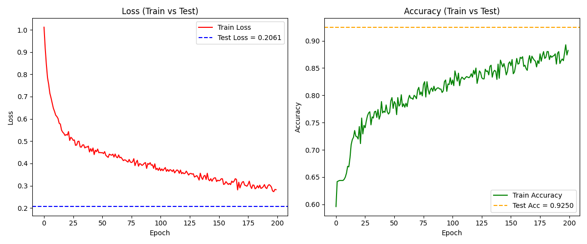

# MLP-Scheduling-Predictor_OSPROJ

This project uses a **Multi-Layer Perceptron (MLP)** neural network to predict the optimal **CPU scheduling algorithm** for a given set of processes based on their arrival and burst times.

It was developed as a final project for the **Operating Systems** course at **Hamedan University of Technology (HUT)**.

---

## Project Goal

To automatically predict the scheduling algorithm with the **lowest total waiting time** among the following:

- `FCFS` (First Come First Serve)
- `SJF` (Shortest Job First)
- `RR` (Round Robin, with quantum = 4)

The model is trained using a dataset of simulated scheduling scenarios and implemented with **PyTorch**.

---

## Dataset

The dataset includes **1200 samples**, each consisting of:

- 4 process **arrival times**
- 4 process **burst times**
- A **label** indicating the best scheduling algorithm based on lowest total waiting time

### Label Selection Rules

In case of a tie in waiting times, the following priority is used:

- If `FCFS` and `SJF` tie → label is `FCFS`
- If `FCFS` and `RR` tie → label is `RR`
- If `SJF` and `RR` tie → label is `SJF`

---

## Model Architecture

- **Input Layer:** 8 features (4 arrival + 4 burst)
- **Hidden Layers:** 2 fully connected layers (ReLU, Dropout)
- **Output Layer:** 3 neurons (one for each scheduling algorithm)
- **Loss Function:** CrossEntropyLoss
- **Optimizer:** Adam

---

## Results

- The model was trained over 100 epochs.
- **Final Test Accuracy:** 92.5%
- **Final Test Loss:** 0.2061

### Classification Report
```
              precision    recall  f1-score   support

           0       0.86      0.92      0.89        77
           1       0.96      0.93      0.94       163

    accuracy                           0.93       240
   macro avg       0.91      0.92      0.92       240
weighted avg       0.93      0.93      0.93       240
```

### Confusion Matrix
```
[[ 71   6]
 [ 12 151]]
```

### Training Curve


---

##  How to Run

1. **Clone this Repository**
   ```bash
   git clone https://github.com/Mahyas-G/MLP-Scheduling-Predictor_OSPROJ.git
   cd MLP-Scheduling-Predictor_OSPROJ
   ```

2. **Create and Activate Environment (optional)**
   ```bash
   conda create -n mlp_sched python=3.9
   conda activate mlp_sched
   ```

3. **Install Dependencies**
   ```bash
   pip install -r requirements.txt
   ```

4. **Train the Model**
   ```bash
   python train.py
   ```
   
5. **Run Predictor on New Input**
   ```bash
   python predictor.py
   ```
   
---

## Files Overview

| File                  | Description                                        |
|-----------------------|----------------------------------------------------|
| `dataset.csv`         | Final dataset with 1200 samples                    |
| `dataset_generator.py`| Code to generate the dataset with correct labels   |
| `model.py`            | PyTorch MLP model definition                       |
| `train.py`            | Training loop, evaluation, model saving            |
| `predictor.py`        | Script to predict best algorithm for new inputs    |
| `requirements.txt`    | Python package dependencies                        |
| `README.md`           | Project documentation                              |
| `assets/training_plot.png` | Accuracy/Loss training curve image             |

---

## Authors

- **Mahyas Golparian**  
- **Sara Kargar**


Instructor: Dr. Mirhossein Dezfulian

Final Project — Operating Systems Course — Hamedan University of Technology (HUT) 


---

## License
  
Feel free to use, modify, and share for educational purposes.

---
